<p align="center"></p>

<p align="center">Procedural generation of a complete fictional world from a single seed: continents formed by plate tectonics, erosion, climate and drainage,<br>and a street-level plan for each settlement on them.</p>

<p align="center"><b><a href="https://jannchie.github.io/cartographer/">Live demo</a></b></p>

<p align="center"><b>English</b> · <a href="README.zh-CN.md">中文</a> · <a href="README.ja.md">日本語</a></p>

Cartographer simulates plate collision, fluvial erosion, monsoon precipitation and river-network formation in sequence, producing terrain whose features follow from the processes that formed them, and renders the result as a paper map or a 3D diorama. Selecting a town on the world map generates its street plan: streets are laid out along the terrain, and walls, palaces, shrines, markets, harbours and fields are arranged according to the conventions of the town's culture.

Intended for maps in fiction, tabletop role-playing and game settings. A given seed always produces the same world. Town size is continuously adjustable, and existing buildings remain in place as a town expands. Maps export to PNG and SVG; all parameters are encoded in the URL, so a shared link reproduces the same map.

```bash
pnpm install
pnpm dev        # open http://localhost:5190
```

## World

<p align="center">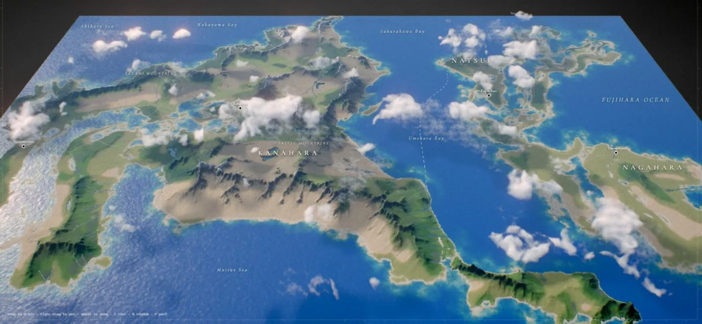</p>

Terrain is generated in the following stages:

- **Plates and orogeny**: plates are modelled as warped Voronoi cells. Convergent boundaries raise mountain ranges and island arcs; divergent boundaries form rifts and mid-ocean ridges. The sea floor includes continental shelves, trenches and hotspot island chains.
- **Erosion**: a stream-power model iterates tectonic uplift against fluvial incision on a coarse grid to form dendritic valleys; droplet erosion and thermal weathering are then applied at full resolution.
- **Climate and hydrology**: temperature is derived from latitude, elevation and continentality. Moisture advected by the wind belts produces wet windward slopes and rain shadows. Flow directions are computed with Priority-Flood, and a water balance determines exorheic lakes, endorheic lakes and salt flats.
- **Biomes and naming**: biomes are classified on a Whittaker temperature–precipitation diagram. Each world has its own generated language for naming continents, seas, ranges, lakes and cities, with corresponding Chinese, English and Japanese forms.

The 3D diorama supports real-time shadows, volumetric clouds, water reflections, a day–night cycle, an automated flyover and film-style colour grading. Edit mode provides brushes for raising and lowering terrain and adjusting temperature and precipitation, as well as adding or removing towns and defining continents; climate and hydrology are recomputed after each edit.

The hologram view presents the same world as luminous wireframe on a projection table: land is raised into slabs with lit edges, coastlines are drawn as double lines, and major cities and summits carry leader lines and elevation dimension lines. The table is framed by latitude and longitude scales, wireframe walls showing the terrain side profile, and a top grid plane suspended above the map. Hovering over or selecting a landmass displays its area, highest point and centre coordinates. The view redraws only when the camera or selection changes and uses no GPU time while static.

<p align="center"></p>

The hologram view offers four colour schemes:

| Tactical | Alert | Radar | Polar |
| :-: | :-: | :-: | :-: |
| 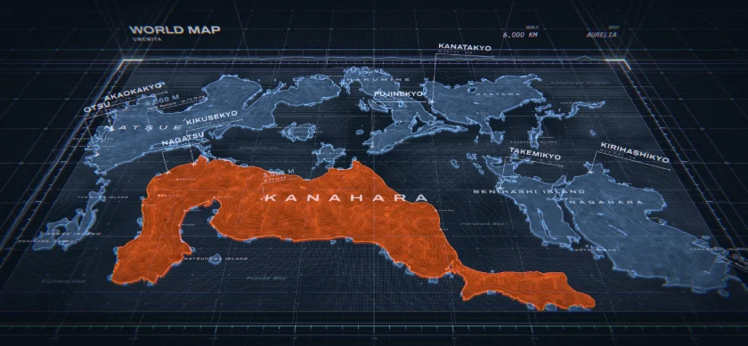 | 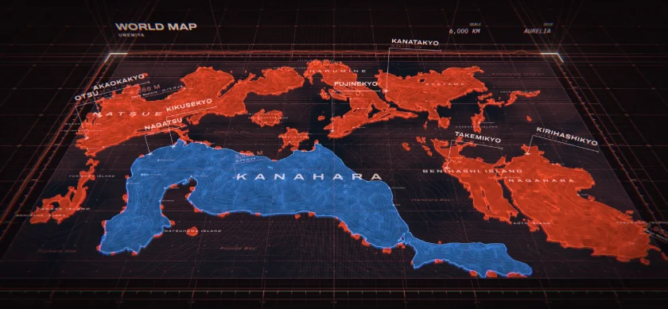 | 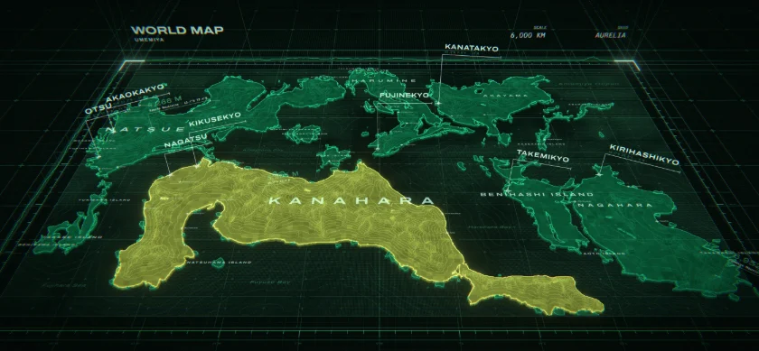 | 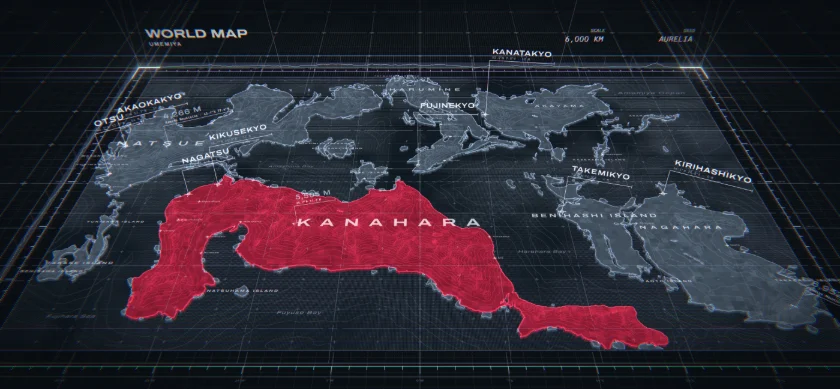 |

Six paper-map styles are available, each with label placement, scale bar and frame. While browsing, the frame remains fixed and zooming applies only to the map content:

| Physical | Fantasy | Nautical |
| :-: | :-: | :-: |
| 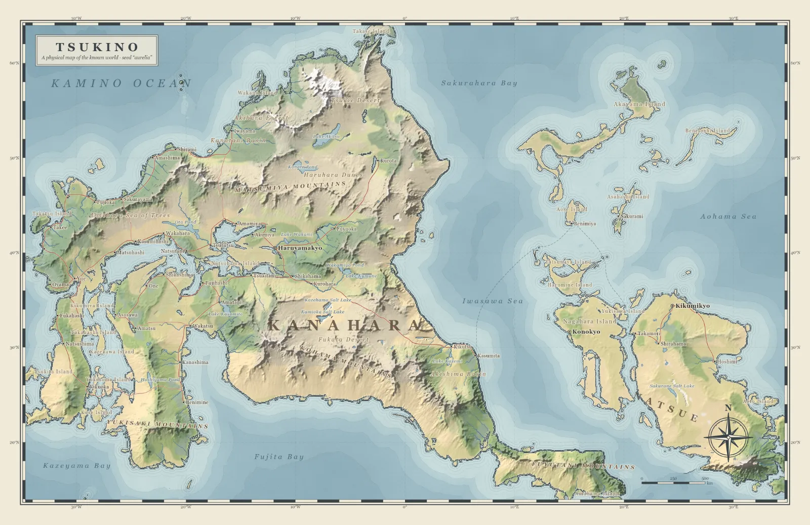 |  | 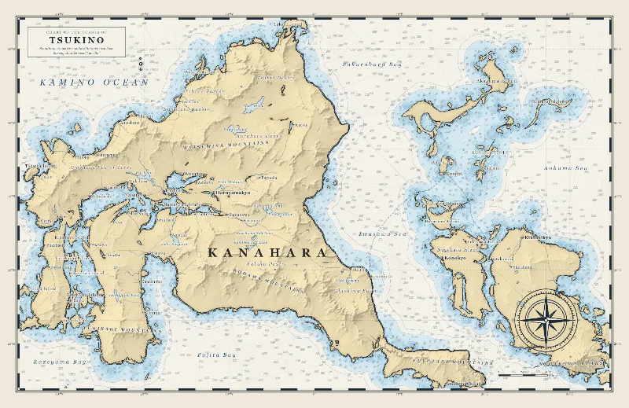 |
| **Teyvat** | **Ink wash** | **Topographic** |
| 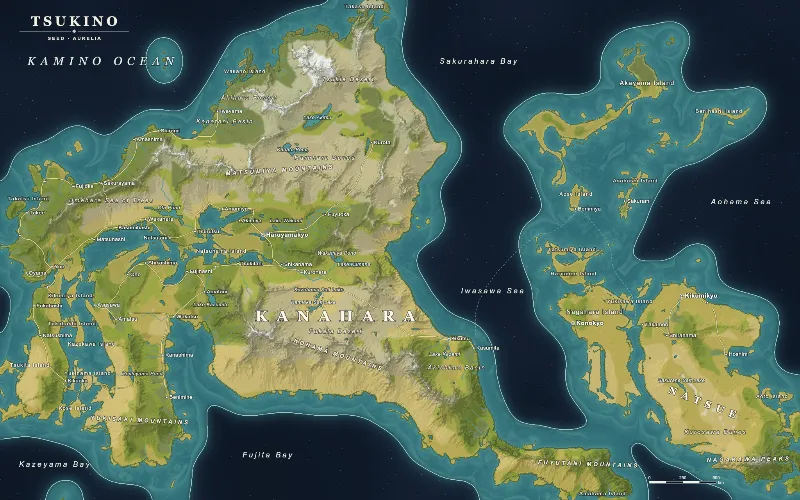 | 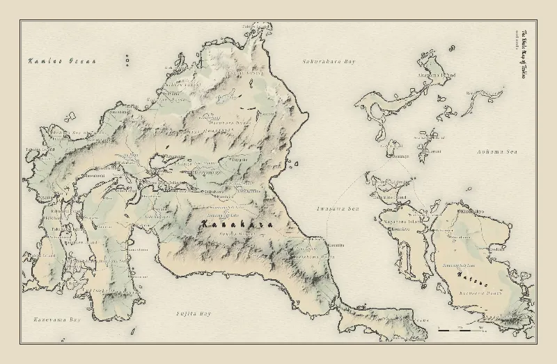 | 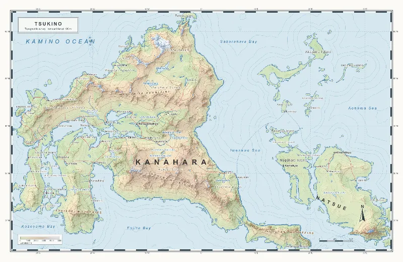 |

### Observed data

Besides procedurally generated worlds, two templates are built from observed data:

- **Earth**: the whole globe at 5′ or 15′ resolution. Elevation from NOAA ETOPO 2022, climate from WorldClim 2.1, biomes from RESOLVE Ecoregions 2017, and coastlines, lakes, rivers and place names from Natural Earth.
- **China**: a regional map in a Lambert conformal conic projection (standard parallels 25° N and 47° N) at 1′ resolution, with province- and prefecture-level divisions from DataV.GeoAtlas. Areas outside China show terrain only. Boundaries and disputed areas follow the official position of the People's Republic of China.

The source data are not part of the repository. They are downloaded separately and converted with the commands below; the download location of each dataset is listed at the top of the corresponding script.

```bash
pnpm tsx scripts/earth-real.ts <source-dir>   # writes public/earth/
pnpm china <source-dir>                        # writes public/china/
```

## Settlements

The population slider expands the same town continuously from a hamlet of a few dozen people to a city of tens of thousands; the expansion can also be played as an animation. Terrain is defined in world coordinates, so hills, rivers and coastline remain fixed as the town grows.

| 120 people | 1,500 people |
| :-: | :-: |
| 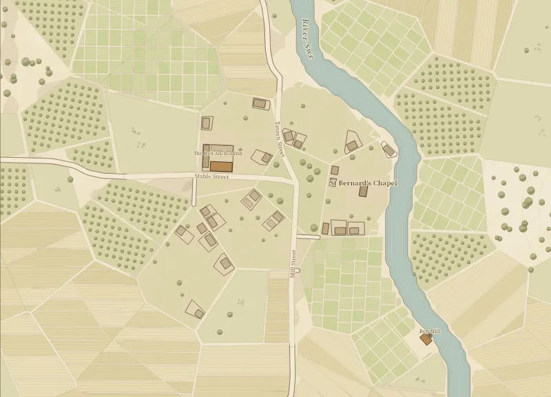 | 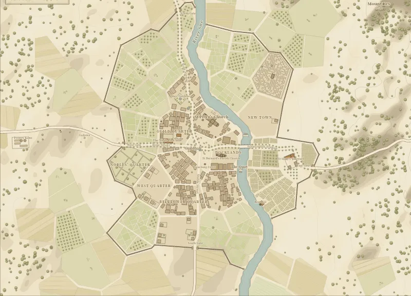 |
| **6,000 people** | **24,000 people** |
| 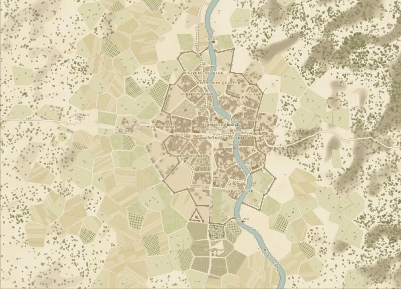 | 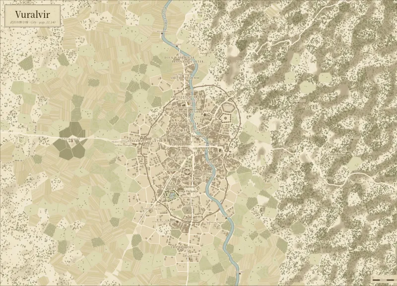 |

Four cultures, each with distinct town plans, building types and naming conventions; place names correspond across the three languages:

| Western · organic harbour town | Chinese · walled-ward capital |
| :-: | :-: |
| 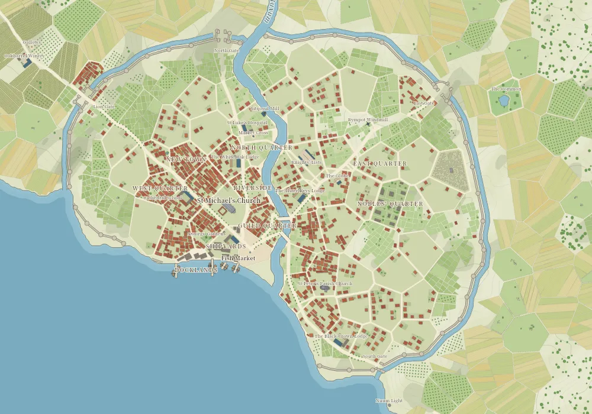 | 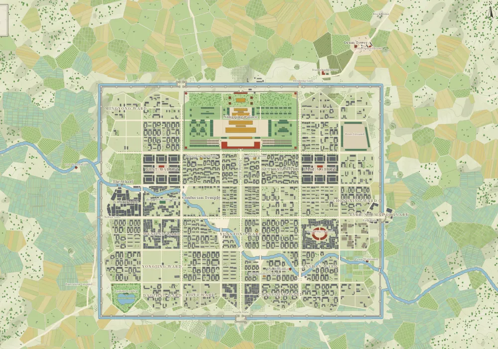 |
| **Japanese · castle town** | **Islamic · medina** |
| 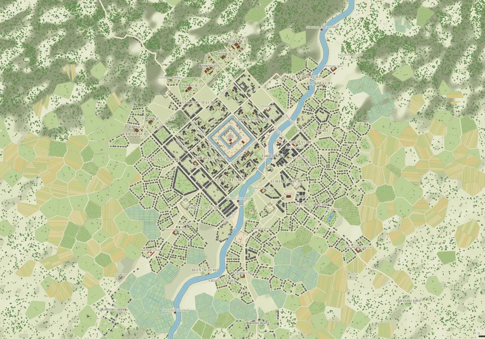 | 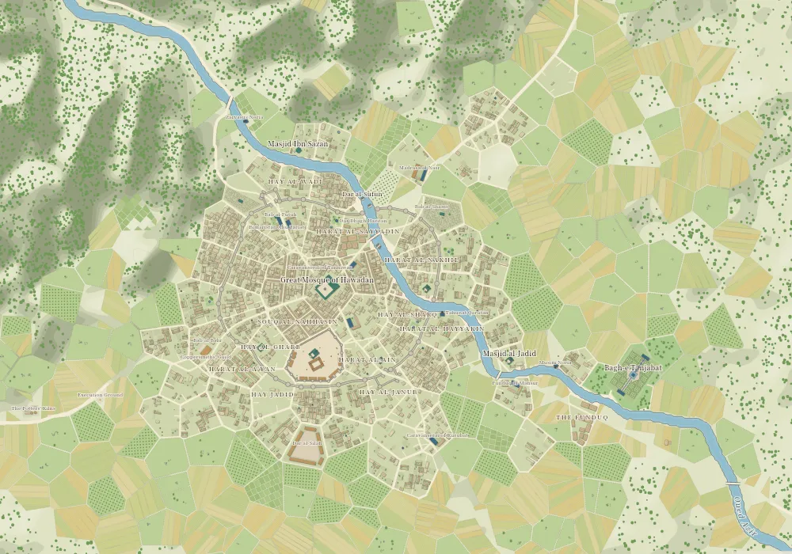 |
| **Western · Roman castrum** | **Western · medieval bastide** |
| 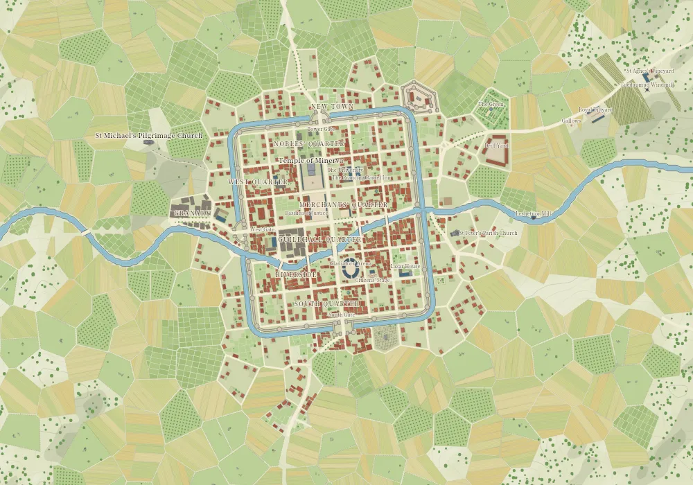 | 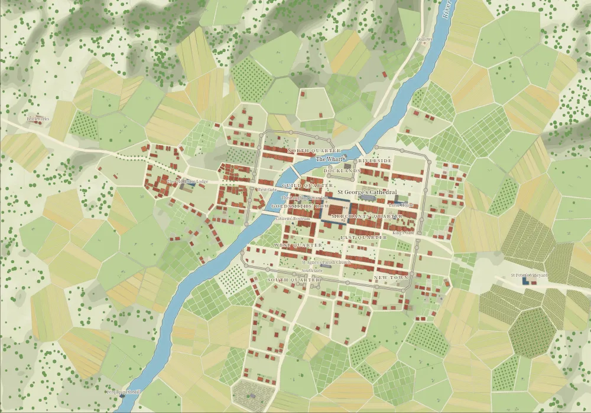 |

- **Western**: organic lanes, castle and curtain wall, cathedral, market square and three-field strips; the Roman castrum and the medieval bastide are available as planned layouts.
- **Chinese**: a south-facing walled grid of walled wards with cross streets, East and West Markets, a palace at the north and courtyard houses; family tombs are placed on the hillsides outside the walls.
- **Japanese**: castle town (keep, samurai and merchant quarters, temple row, masugata gates), or a Heian-kyō style jōbō grid (Greater Palace, sixteen chō per ward, Rajōmon).
- **Islamic**: a great mosque and souq at the centre, courtyard houses along dead-end lanes, hammams and caravanserais, and a palace composed of courts along an axis.

### Landmarks

Palaces, temples, churches, castles, mosques and parks are composed from skeleton rules and element pools. The layout grammar of each tradition determines the plan (an axial sequence of courts, a temple compound arrangement, the nave and transept of a church, a pond-and-stroll garden, and so on), and the seed selects the components. Palaces of the same culture rarely coincide, and existing landmarks retain their form as the town expands.

| Palace city | Cathedral and cloister | Senbon torii |
| :-: | :-: | :-: |
|  |  |  |
| **Torii in the sea** | **Hilltop abbey** | **Scholar's garden** |
|  |  |  |
| **Karesansui** | **Parterre** | **Chahar bagh** |
|  |  |  |

- **Scale**: landmarks fall into four tiers, from wayside shrines and parish churches, through temples occupying an entire ward, to grand shrines and concentric castles spanning several wards. Small landmarks are distributed through the town and countryside; large ones are rare.
- **Notable sites**: senbon torii tunnels, torii standing in the sea, mountaintop inner shrines with long stairways, mountain temples, abbeys and crag castles appear with low probability, and only where the terrain permits.
- **Layout consistency**: every gate is served by a road, bridges cross rivers perpendicularly, kitchen gardens lie inside the walls and grain fields outside, and burial grounds occupy slopes beyond the town.

### Skins and views

Each town can be rendered in eight skins:

| Parchment | Colour | Engraving | Blueprint |
| :-: | :-: | :-: | :-: |
| 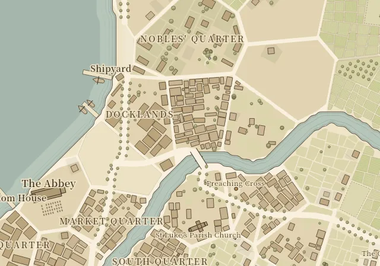 | 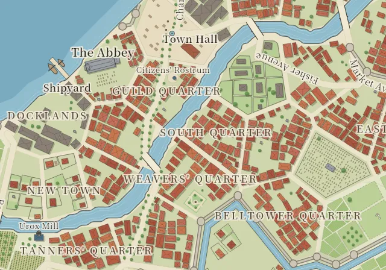 | 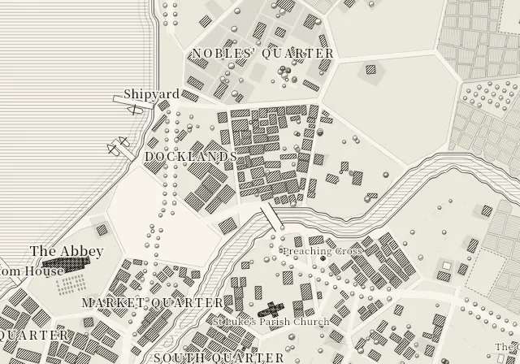 | 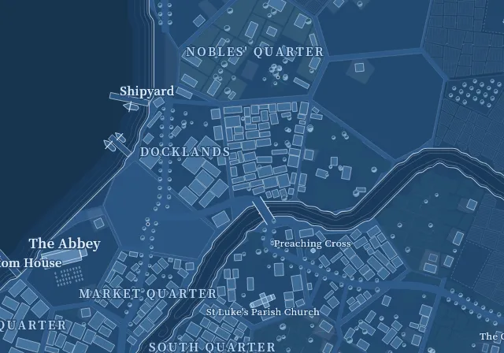 |
| **Kiriezu** | **Nolli plan** | **Gazetteer** | **Survey** |
| 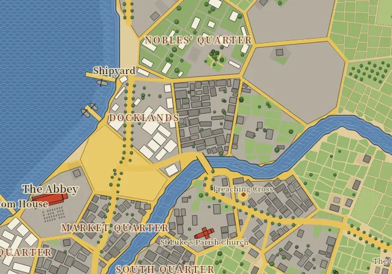 | 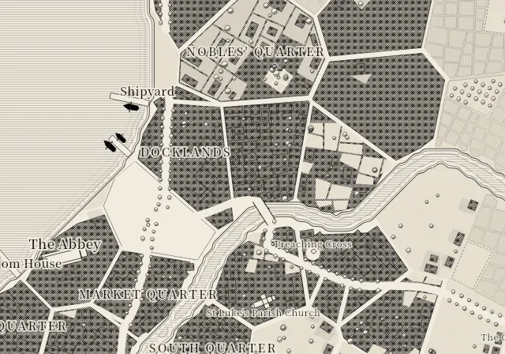 | 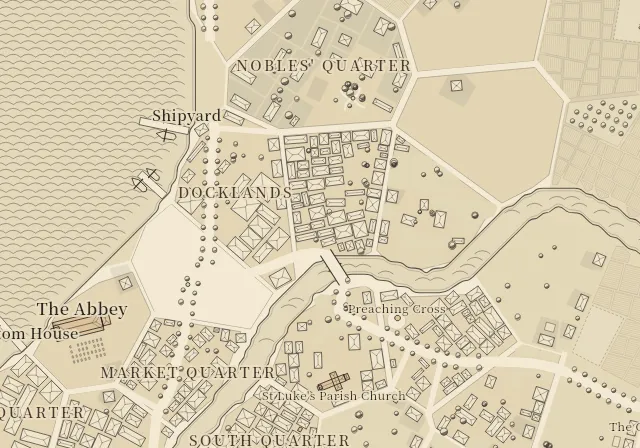 | 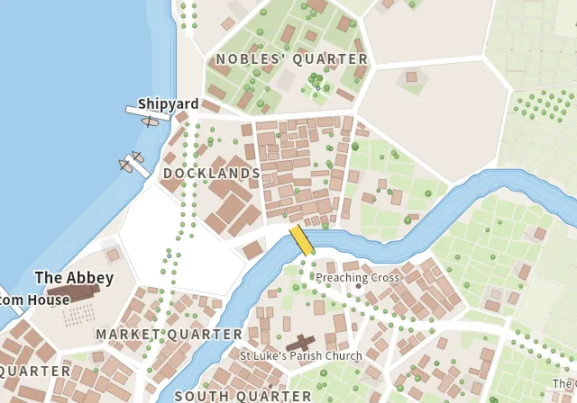 |

The zoning view colours wards by land use and lists the share of the urban area for each class:

<p align="center">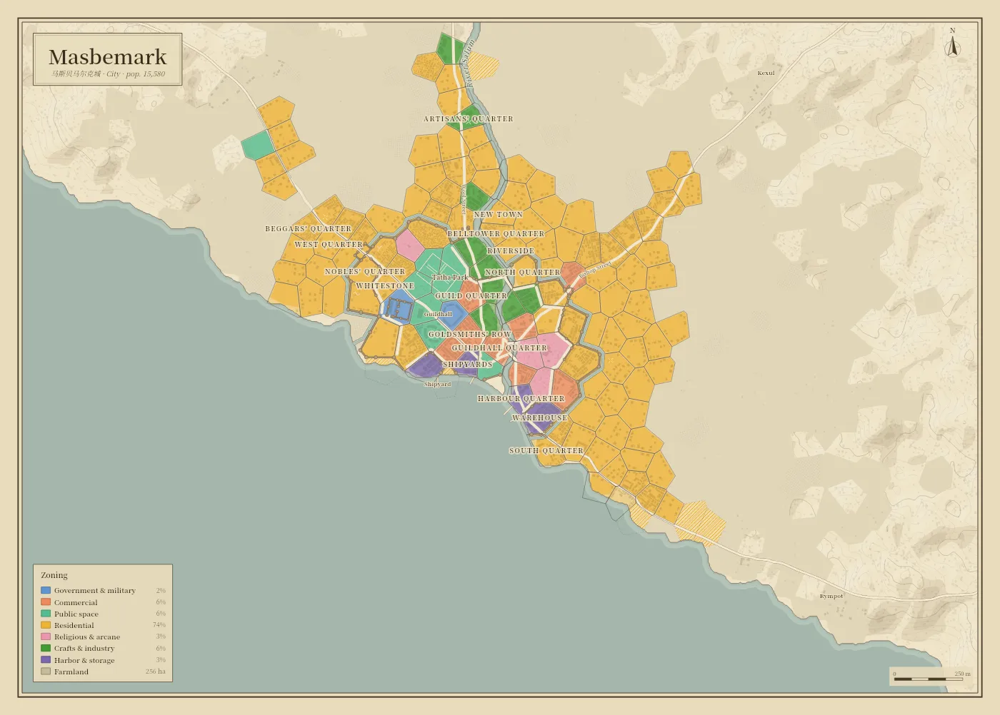</p>

- **Hover details**: detailed information on the feature under the cursor, e.g. "Townhouse · 4 storeys · 3 households · 19 residents · weaver, baker", "Field · wheat, rye, oats (three-field rotation)", "Zigzag bridge".
- **Occupations**: population and households are counted by the occupation of the household head, with each class expandable into individual trades. Family members, including children, are counted with their household; apprentices and shop hands are counted under the trade of the head, and servants separately. Household size varies with the floor area of the home and the trade, so that a mansion may hold twenty or thirty people. The classification follows each culture: the four occupations in China, samurai and the three commoner orders in Japan, clergy, nobility, merchants, craftsmen and peasants in Europe, and ulama, officials, merchants, artisans and farmers in Islamic towns.
- **World synchronisation**: when a town is selected under "World place", its name, size, river direction, coast, hills and climate are synchronised with the corresponding location on the world map.
- **Randomisation**: either the seed alone is replaced and other settings are retained, or the current terrain is fixed and only the town is regenerated.

## Offline rendering

Maps can be rendered directly in Node for parameter tuning and batch output:

```bash
pnpm atlas:png aurelia physical,ink out/                          # world paper maps
pnpm settlement:png edo city color out/ culture=wa plan=jokamachi  # settlement map; key=value overrides params
pnpm showcase                                                      # regenerate the images in this README (zh/en/ja)
```

Additional scripts: `preview:png` (biome preview with timing for each generation stage) and `shade:png` (a base map containing only terrain relief shading).

## Videos

`video/` contains programmatic videos built on the hologram view. Each video is a page whose content depends only on the frame number; `pnpm video <name> <out.mp4>` renders it frame by frame in Chrome and encodes a 3840 × 2160 file with ffmpeg. The first video, *China Expressway Network 1988–2025*, shows the national expressway network growing year by year alongside the official mileage. Data preparation, preview and recording are described in [video/README.md](video/README.md).

## License

The code is released under the [MIT](LICENSE) license. Data generated by the scripts retain the licenses of their sources, which are listed in each script and in [video/README.md](video/README.md).
